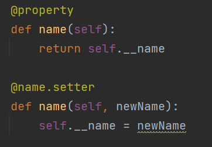

> Photo by <a href="https://unsplash.com/@exxteban?utm_source=unsplash&utm_medium=referral&utm_content=creditCopyText">Esteban Lopez</a> on <a href="https://unsplash.com/s/photos/hero?utm_source=unsplash&utm_medium=referral&utm_content=creditCopyText">Unsplash</a>

# Superhero Battle Royale
In this project, you will be working with a dataset of more than six hundred [differently-powered individuals](https://tvtropes.org/pmwiki/pmwiki.php/Main/DifferentlyPoweredIndividual). Some good, some bad, some neutral - each has different strengths and weaknesses, and they are being called for a showdown in the ultimate media crossover event. 

In this project, you will develop a program that demonstrates you can:
- Develop your own classes based on the characteristics of items in a dataset
- Develop your own child classes based on more nuanced object characteristics
- Develop your own methods that override methods in a parent class
- Use polymorphism to conduct an analysis of objects that are similar but of different types
- Use encapsulation to protect object variables

## Step 1 - Inspect the Included Dataset
The included file, `SuperpowerDataset.csv`, contains a collection of super-powered or notable fictional individuals: heroes, villains, cosmic entities, starship captains, and many more. This is a comma-separated value (csv) file, and each line is a record. The properties of each record are separated by a comma. This is a simple text file format that is supported by many programming languages and packages. The more you work with these, the harder it will become to make a trip to a pharmacy without a verbal slip.

Each has a set of characteristics that define them:

- **Intelligence**: how smart are they? can they think their way out of a trap, or devise one for their foes?
- **Strength**: how much can the lift, push or pull, in terms of physical mass?
- **Speed**: how fast are they? how quick are their reflexes? can they get out of trouble fast, or bring trouble to the enemy?
- **Durability**: can they take a hit? can they walk away unscathed, and live to fight another day?
- **Power**: do they have an amazing superpower, such as a Jedi using the force or Godzilla blowing energy across entire cities? Or is this Paul Blart, Mall Cop (I'm not kidding...he's in here, and he's terrible).
- **Combat**: are they scrappy, and good in a fight?
- **Others**: gender, race, eye color, and other descriptive characteristics.

| Name        | Intelligence | Strength | Speed | Durability | Power | Combat | Full name              | Alignment | Gender | Race              | Height (cm) | Weight (kg) | Eye color | Hair color | Occupation                                            |
|-------------|--------------|----------|-------|------------|-------|--------|------------------------|-----------|--------|-------------------|-------------|-------------|-----------|------------|-------------------------------------------------------|
| 3-D Man     | 80           | 35       | 45    | 35         | 25    | 55     | Charles Chandler       | good      | Male   | -                 | 188         | 90          | Brown     | Grey       | Test pilot  adventurer                                |
| Abe Sapien  | 95           | 30       | 35    | 65         | 100   | 85     | Abraham Sapien         | good      | Male   | Icthyo Sapien     | 191         | 65          | Blue      | No Hair    | Paranormal Investigator                               |
| Abin Sur    | 80           | 90       | 55    | 65         | 100   | 65     | -                      | good      | Male   | Ungaran           | 185         | 90          | Blue      | No Hair    | Green Lantern  former history professor               |
| A-Bomb      | 75           | 100      | 20    | 80         | 25    | 65     | Richard Milhouse Jones | good      | Male   | Human             | 203         | 441         | Yellow    | No Hair    | Musician  adventurer  author; formerly talk show host |
| Abomination | 85           | 80       | 55    | 90         | 65    | 95     | Emil Blonsky           | bad       | Male   | Human / Radiation | 203         | 441         | Green     | No Hair    | Ex-Spy                                                |

Open up the file in the spreadsheet application of your choice (e.g., Excel, Google Sheets) and review the data to get acquainted with it. Try to get a sense for the different types of characters there, and look for things they have in common.

## Step 2 - Develop Classes for Heroes and Villains - Polymorphism
In your src folder, we have provided you with a main called `BattleRoyale`. This main opens the data file and reads each line as a dict object. The reader is smart enough to read the header line in the data file and use those as the key names. An example is provided so that you can see how to access a few of the values by their key, so if you need to access others, just make sure that spelling and spacing follows exactly what's on the first line of the data file. 

You're going to start by designing two classes that these values can be placed into: a `Hero` class and a `Villain`. Superficially, these classes are going to be incredibly similar. You may even find it beneficial to finish one class completely, then copy and paste it into a new file with the other name. It's up to you. 

- Both classes have an `init` method that takes seven parameters: name, intelligence, strength, speed, durability, power, and combat. You can make these positional or keyword parameters, or some combination. It's up to you.
- Both classes have a `getStats` method that returns the sum of **any three** numeric characteristics (intelligence, strength, speed, durability, power, or combat). However, whichever three are used for `Hero`, the other three should be used for `Villain`. Which is assigned to each type is up to you, but they should not overlap. For example, if you assign intelligence, strength, and speed to Hero, then that leaves durability, power, and combat for Villain.
- Both classes should have a `getBonus()` method. This should contain conditional logic that returns a small positive or negative "boost" integer based on the attributes of this object. Do you think that smart Villains are craftier? Then _if intelligence > 90, return 10_. Do you think that low combat heroes should get a handicap? Then _if combat < 70, return -15_. This can be more complicated if you like, but at minimum, at least one conditional check against the _numeric_ variables of this object should be made to determine the value that is returned. This method should differ between the Hero and Villain classes, and shouldn't return too large of a boost - something in the order of 0 to +/- 30.

**Deliverable 1:** Two classes matching the requirements above. At a minimum, the classes have an init method, a getStats method, and a getBonus method. 

**Deliverable 2:** Modify the main so that data for good characters are created as Heroes, and data for bad characters are placed into Villains (indicated by the `Alignment` field in the dataset). Place all created objects of both types into a single list. If a character is neither good nor bad, pick one of the classes to assign it to, just be consistent.

## Step 3 - Protect your data - Encapsulation
Given the high stakes of this Battle Royale, we want to make sure that neither side cheats. We are going to protect our important attributes by indirecting variable access to getters and setters. 

**Deliverable 3:** For each of the seven attributes passed to the init, use property decorators and setters to limit access to the explicitly private variable. In the setter for the numeric parameters, check the type and range of the passed value to ensure that it's an int that is in the range from 0 to 105.

Here is an example for the name property:

## Step 4 - Child of Evil, Child of Good - Inheritance

To complete this step, you must design two more classes. These will be child classes - one that extends Hero, and one that extends Villain. The key difference between a parent and its child is the value of one of the _categorical_ attributes (e.g., Hair Color, Race). Objects of this class will still be good or evil, but you are looking to identify some sub-category of character that's going to get a slightly different bonus. Should red-haired Villain characters get a boost? Implement it here. Should non-human Hero characters get a handicap? It's really up to you, as long as the getBonus() still returns a reasonable `int`.

**Deliverable 4:** Two classes matching the requirements above. At a minimum, the classes have an init method and a getBonus method. The getBonus method should use one of the _categorical_ attributes to determine the amount returned.

**Deliverable 5:** Modify the main so that data for your child classes are used to create objects of the appropriate. Place all created objects of both types into a single list along with the Hero and Villain objects 

## Step 5  - Ready to Rumble 

In the `BattleRoyale` main, after you have created all of your different objects and added them to a list, you are now ready to rumble! Each character should fight each other once, so you are likely going to need some kind of nested loop. The winner of each pairing is whoever has the highest result  of `getStats()` + `getBonus()`. It is possible to have a tie.

Once you have a winner, track who won, lost, or if it is a tie. You may find it handy to add a method to one or more of your classes to update this data for that object. Or, you can track this in the main using a secondary data structure. 

Some conditions:
- A character does not fight itself (two characters with the same name can still fight each other). 
- Each pairing should occur only once. This should not be an n2 battle, but an n(n-1)/2 battle.
- Everyone fights everyone, regardless of good/bad/neutral status. The stakes are high!

**Deliverable 6 :** The`main` that loads the file and matches each character against all the others according to the rules above, tracking wins/losses/ties for each character.

## Step 6 - Report your Results

Once the battle has concluded, output your results to the terminal for subsequent review. 

The report should consist of two formatted sections: 

1. Which character had the best record, if wins are worth one point and a tie is worth 0.5? Which character had the worst record? For both, what was their type (i.e., class)?
2. For each individual character, report how many times they win, lose, or tie. Each character should get its own line. These can be printed in any order. Any formatting is acceptable, as long as it's legible.

**Deliverable 7 :** Your code generates a report with the required sections.

# Extra credit
Wow, Hero and Villain sure are similar! As described above, they are so similar, in fact, that you might want to have completed one entirely then copy and pasted it into the other. Any time we are copying and pasting code, it is usually a sign to us that there is a better way. In the worst case, it can lead to copy and paste errors, and in the best case, it is just a waste of time.

**EC Deliverable:** Rewrite the Hero and Villain classes as child classes of a single class called `SuperPower`. Move all duplicated methods into that class so that only the methods that differ are still present in Hero and Villain. You may only want to attempt this after getting everything else working, because this entails redesigning your Hero and Villain classes, which might break otherwise working code if you are unsuccessful.

# Getting Stuck
There are times when you might get stuck on some part of an assignment. It happens to the best of us. If you need assistance on a specific part of your code, then be sure to try to `push` the most recent version of your files to GitHub. It makes it much easier for your instructor and TA to provide specific feedback on individual lines of code in the files that you submit. 

